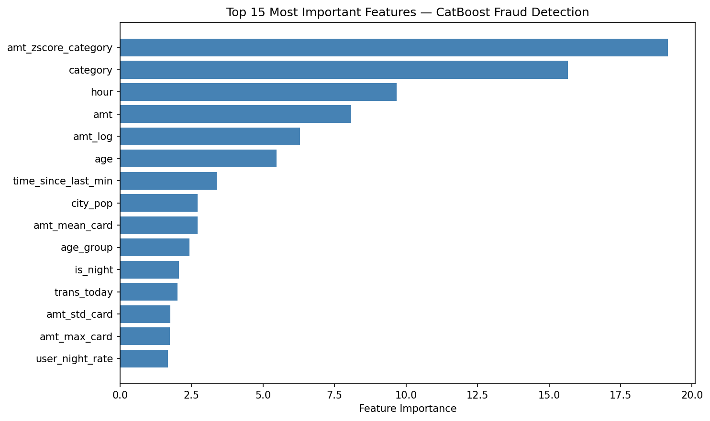
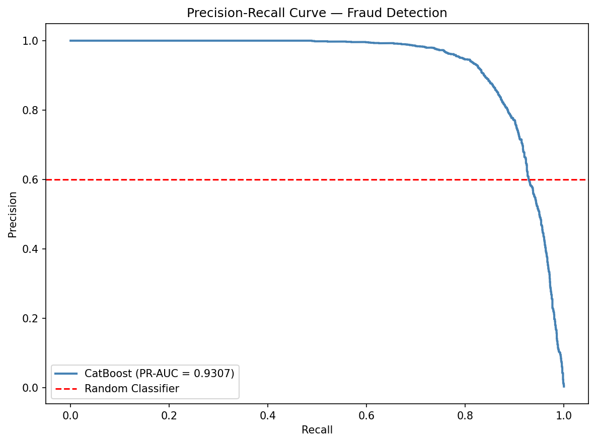
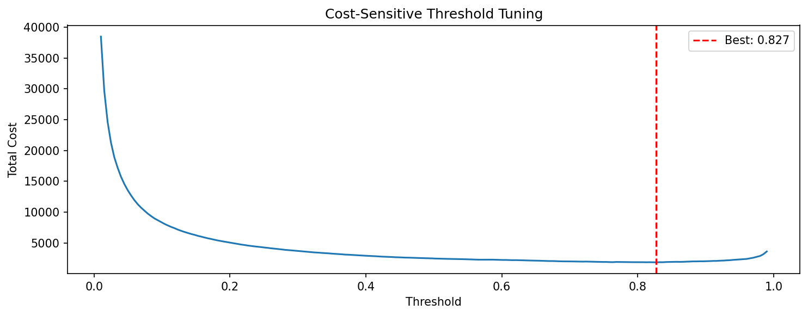

# Credit Card Fraud Detection — 0.92 PR-AUC

> Detecting financial fraud in a dataset with **0.6% fraud rate** using CatBoost with
> advanced feature engineering and cost-sensitive optimization.

## Results

| Metric | Value |
|--------|-------|
| **Test PR-AUC** | **0.9284** |
| Test ROC-AUC | 0.9986 |
| Fraud Recall | 0.90 |
| Precision | 0.77 |
| Val→Test Gap | 0.028 |

> Evaluated on held-out `fraudTest.csv` — never seen during training or tuning.

---

## The Problem

Credit card fraud costs billions annually. With only **0.6% of transactions being fraudulent**,
standard models fail — optimizing accuracy gives 99.4% by predicting nothing is fraud.
This project solves the real problem: **finding fraud without drowning analysts in false alarms.**

---

## Key Technical Decisions

### Why PR-AUC, not Accuracy or ROC-AUC
At 0.6% fraud rate, ROC-AUC is misleading — a model predicting all legitimate
still scores 0.99. PR-AUC directly measures the precision-recall tradeoff on
the minority class, making it the only honest metric here.

### Why CatBoost over XGBoost
XGBoost with Leave-One-Out encoding achieved **0.67 test PR-AUC** with a
**0.11 val→test gap**. Switching to CatBoost's native ordered target statistics:
- Eliminated encoding drift between train and test periods
- Reduced val→test gap from **0.11 → 0.028**
- Improved test PR-AUC from **0.67 → 0.93**

### Why Time-Based Split
Fraud data is temporal. Random splits leak future transaction patterns into
training — inflating scores without improving real detection. Every evaluation
in this project uses strict temporal ordering.

---

## Most Impactful Features

| Feature | Description | Why It Works |
|---------|-------------|--------------|
| `distance_km` | Haversine distance between cardholder and merchant | Fraud often happens far from home |
| `is_impossible_travel` | Speed > 500 km/h between consecutive transactions | Physically impossible = stolen card |
| `amt_zscore` | Amount vs card's own historical mean/std | Fraud spikes above normal spend |
| `amt_mean_card` | Expanding mean of card's transaction history | Baseline for anomaly detection |
| `merchant_first_use` | First time card used at this merchant | New merchant + high amount = fraud signal |
| `time_since_last_min` | Minutes since card's last transaction | Rapid succession = card testing |
| `is_rapid_succession` | Transaction within 5 min of previous | Card testing pattern |
| `is_dormant_reactivation` | >7 day gap + amount above card mean | Stolen dormant card pattern |
| `dist_from_last_trans` | Distance between consecutive merchant locations | Impossible geography |
| `amt_zscore_category` | Amount vs category's historical distribution | Overspend in specific category |

---

## Methodology
```
Raw Data (1M rows, 0.6% fraud)
        ↓
Time-Based Split (80/20) — no data leakage
        ↓
Feature Engineering (40+ features)
        ↓
CatBoost with Native Categorical Encoding
        ↓
Optuna Hyperparameter Tuning (20 trials, TPE)
        ↓
Cost-Sensitive Threshold Tuning (FP=1, FN=6)
        ↓
Final Evaluation on fraudTest.csv
```

---

## Hyperparameter Tuning

Used **Optuna with TPE sampler** to tune 7 parameters:
```python
best_params = {
    'learning_rate':       0.0375,
    'depth':               10,
    'l2_leaf_reg':         7.976,   # most important — 0.28 importance
    'scale_pos_weight':    243.95,
    'bagging_temperature': 0.895,   # second most important — 0.25 importance
    'random_strength':     1.995,
    'border_count':        240,
}
```

**Parameter importance (from Optuna):**

| Parameter | Importance |
|-----------|------------|
| l2_leaf_reg | 0.28 |
| bagging_temperature | 0.25 |
| border_count | 0.18 |
| scale_pos_weight | 0.09 |
| depth | 0.07 |

---

## Cost-Sensitive Threshold Tuning

Default 0.5 threshold optimizes for accuracy — wrong for fraud detection.
This project finds the optimal threshold by minimizing business cost:
```
Total Cost = (False Positives × 1) + (False Negatives × 6)
```

**Result:** Threshold of 0.862 achieves:
- Recall: **0.89** — catching 89% of fraud
- Precision: **0.80** — 80% of flagged transactions are genuine fraud



---

## Dataset

Simulated credit card transactions from the
[Kaggle Fraud Detection Dataset](https://www.kaggle.com/datasets/kartik2112/fraud-detection)
(Sparkov simulation).

| Split | Rows | Fraud Rate |
|-------|------|------------|
| fraudTrain.csv | ~1.2M | ~0.6% |
| fraudTest.csv | ~555K | ~0.4% |

> Dataset is not included in this repository.
> Download from Kaggle using the instructions below.

---

## Setup

### 1. Clone repository
```bash
git clone https://github.com/mallapuabhiraj/fraud-detection-catboost
cd fraud-detection-catboost
```

### 2. Install dependencies
```bash
pip install -r requirements.txt
```

### 3. Download dataset from Kaggle

**Option A — Kaggle API:**
```bash
pip install kaggle
kaggle datasets download -d kartik2112/fraud-detection
unzip fraud-detection.zip
```

**Option B — Manual:**
1. Go to [kaggle.com/datasets/kartik2112/fraud-detection](https://www.kaggle.com/datasets/kartik2112/fraud-detection)
2. Click Download
3. Place `fraudTrain.csv` and `fraudTest.csv` in project root

### 4. Run notebook
Open `notebooks/fraud_detection.ipynb` in Colab or Jupyter.

---

## Project Structure
```
fraud-detection-catboost/
│
├── README.md
├── requirements.txt
├── config.json                 ← best hyperparameters
├── notebooks/
│   └── fraud_detection.ipynb  ← full pipeline
└── src/
    └── preprocess.py          ← feature engineering
```

---

## Skills Demonstrated

`CatBoost` `Optuna` `Feature Engineering` `Imbalanced Learning`
`Time-Series Validation` `Cost-Sensitive ML` `Hyperparameter Tuning`
`Fraud Detection` `Python` `Scikit-learn`
